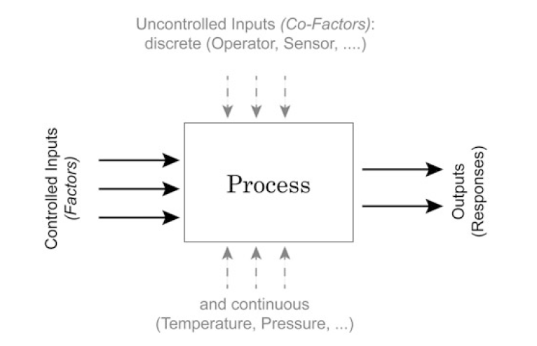

### Research Study Design  

The first step in designing a study is to clearly define its goal. This can involve:  

1. Comparing groups or a group to a fixed value (**hypothesis testing**).  
2. Identifying key factors or effects (**screening investigation**).  
3. Optimizing a response (e.g., variability, distance to target, robustness).  
4. Developing a regression model to quantify the relationship between inputs and a response variable.  

Each goal dictates the study's approach, such as using hypothesis tests or screening while being cautious of artifacts.  

  

---

### Terminology  

In the context of research study design, various terminology can be found:  

- The controlled inputs are often called **factors** or **treatments**.  
- The uncontrolled inputs are called **cofactors**, **nuisance factors**, or **confoundings**.  

---

### Type of Research Study  

| **Type of Research Study**        | **Description**                                                            | **Example**                                                                            |  
|------------------------------------|----------------------------------------------------------------------------|----------------------------------------------------------------------------------------|  
| **Observational**                  | Collect information but does not interact with the population              | Investigate the prevalence of a disease in a specific demographic                      |  
| **Prospective or Retrospective**   | Observes outcomes either forward (prospective) or backward (retrospective) in time | Analyze patient records to study risk factors for a disease (retrospective) or follow patients to monitor outcomes over time (prospective) |  
| **Experimental**                   | Actively manipulates variables to determine cause-and-effect relationships  | Conduct a clinical trial to test the efficacy of a new drug                            |  
| **Cross-sectional**                | Collects data at a single point in time                                    | Assess the prevalence of smoking in a population during one specific year              |  
| **Longitudinal**                   | Collects data over an extended period to observe changes over time         | Track cognitive development in children from infancy to adulthood                      |  
| **Case Study**                     | Provides detailed analysis of an individual or small group                 | Study the recovery process of a unique patient with an uncommon medical condition      |  
| **Meta-analysis**                  | Combines data from multiple studies to derive broader conclusions          | Analyze results from several clinical trials to evaluate overall drug effectiveness    |  
| **Systematic Review**              | Comprehensive review of existing research on a specific topic              | Summarize the evidence on the benefits of a certain public health intervention         |  

---

### Research Design: Sample Selection  

#### **Sample Selection**  
- Choose participants that represent the population of interest to ensure valid results.  

#### **Sample Size**  
- Determine an adequate number of participants to achieve statistical power and generalizability.  

#### **Bias**  
- Recognize and minimize biases, such as selection bias, recall bias, or measurement bias, to maintain validity.  

#### **Randomization**  
- Assign participants to groups randomly to eliminate confounding variables.  

##### **Types of Randomization**:  
1. **Simple Randomization**: Randomly assigns each participant to a group without any restrictions.  
2. **Block Randomization**: Ensures equal group sizes by assigning participants within fixed-size blocks.  
3. **Minimization**: Assigns participants to minimize differences between groups based on specific factors.  
4. **Stratified Randomization**: Ensures balanced group assignments within strata defined by key variables (e.g., age or gender).  

#### **Blinding**  
- Conceals group assignments from participants, researchers, or both to prevent bias:  
  - **Single-Blind**: Only participants are unaware of group assignments.  
  - **Double-Blind**: Both participants and researchers are unaware of group assignments.  

---  

